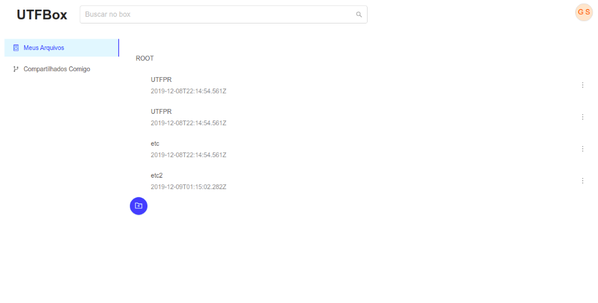
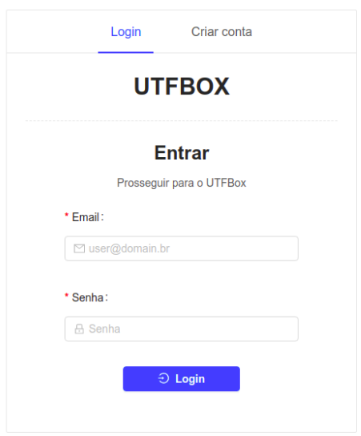

# UTFBOX

A web app that stores files in the cloud!! ☁️

## Getting Started


UTFBOX is a web app developed as a final task for the Distributed Systems discipline at UTFPR-MD computer science course! This software uses Node.js (Typescript), React.js (Javascript) and Socket.io to deploy a cloud storage solution.

### Screenshots




### Installing

To install this software, clone the repo and execute:

```
	git clone <repo>
	cd <repo>
```


To install the **client**:

```
	cd web-client
	npm install
```

To install the **server**:

```
	cd server
	npm install
```

### Running

To run the **client**:

```
	cd web-client
	npm start
```

To run the **server**:

```
	cd server
	npm install
```


## Build With

**Server**
- Typescript;
- Node.js;
- Express;
- Socket.io;
- Mongoose.

**Client**
- React.js;
- Ant Design.

